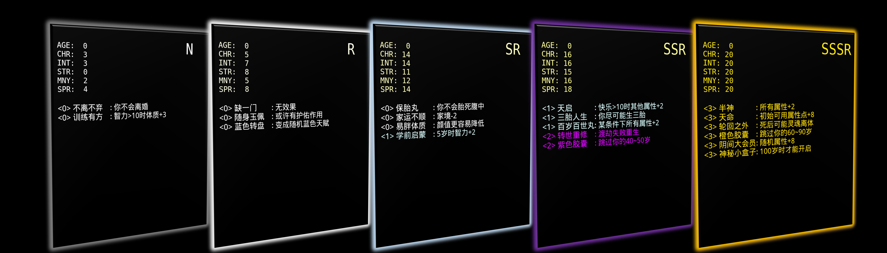

# Loot (for LifeRestart)

<h2>Progress 21.9.16: <b>11111</b>Newborn cards are minted!</h2>

This ia a combination of [Loot Project](https://opensea.io/collection/lootproject) and a popular Chinese game named [Life Restart Simulator](http://liferestart.syaro.io/view/). Moreover, the Loot-based NFT will be enriched with GameFi and P2E mechanism in our development.

Our NFTs [Loot (for LifeRestart)](https://opensea.io/collection/liferestart) are the Bag of properties and perks of a "new life" in the game, sold on OpenSea platform.

All the minted newborn cards (AGE=0) are listed below。We will **not** mint any more newborn card minted, except that there will be a small number of rare event that allows users to mint new cards.

| Type  | Total| Index |
| --- | ----- | ----|
| N  | 10000  | [0, 9999]
| R  | 1000  | [10000, 10999]
| SR | 100  | [11000, 11099]
| SSR| 10 |  [11100, 11109]
|SSSR| 1 | 11110|

## Links
**EN Offical Website** [https://liferestartnft.github.io/en](https://liferestartnft.github.io/en)

The English collection will be launched soon.
**OpenSea collection** [https://opensea.io/collection/liferestart-en](https://opensea.io/collection/liferestart-en)

**Contract** [https://polygonscan.com/token/0x62d9fb7aa6DD88Fa8c1Be34442348B8e7Ae5EB30](https://polygonscan.com/token/0x62d9fb7aa6DD88Fa8c1Be34442348B8e7Ae5EB30)

## Plan

- [x] 2021.09 Launch NFT
- [ ] 2021.11 Airdrop tokens for Play2Earn GameFi
- [ ] 2021.12 Launch Play2Earn GameFi

## Play2Earn

* The game will be text-based on web browsers and mobile phones. The game connects to users' metamask wallet and retrive the NFTs they have.
* There will be a small number of events that triggle **minting** new NFTs. Your original NFTs will not be burned and the new NFTs will be sent to your wallet. These new NFTs are with larger AGE, and better properties.
* There will be token rewards during the game. Please stay tuned.

## Econ

* 20% of the tokens 20% will be airdroped to NFT holders; 10% are left for staking，50% will be kept as reward or locked. The project team keeps the rest 20% for collaboration and advertisment.
* Tokens are used for starting the game, mint a new NFT, buy equipment, potion and blind box.
* We willburn 15% of the income to reduce the total amount of tokens.

This is only a perliminary plan. We will adjust accordingly for a better user experience.

## Contact us

**Twitter** [https://twitter.com/LootLifeRestart](https://twitter.com/LootLifeRestart)

**Email** LifeRestartNFT[at]gmail.com

**Telegram** [https://t.me/LifeRestartNFT](https://t.me/LifeRestartNFT)

## More
Coming soon.
